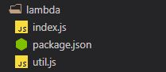
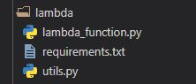

## Welcome to Alexa Developers Hub

This page will help you create and develop Alexa Skills and side-by-side also explain the various concepts of coding which you can apply in other development projects too.

### What should I know?

You should have a Amazon Developer account, if you don't have one [Sign Up](https://developer.amazon.com/) for one.  
It is expected that you have a basic knowledge as to how a skill works, what are intents and slots, and basic understanding of NodeJS or Python.
Get a refresher with this video. (Note: The video is a bit old. A few things have changed in the console as of now.)

<iframe src="https://youtube.com/embed/q-mrSBrlDso" frameborder="0" allowfullscreen="true" width="100%" height="450"> </iframe>

**Excited?**  
Let's get started!

## Install the Alexa Skills Kit CLI


CLI stands for **Command Line Interface**, upon installation of which you can easily control your workflow using the command prompt without going to the Alexa Console.

As you must have known Alexa development can be done in both NodeJS and Python so download them to your system.

- [NodeJS](https://nodejs.org/en/) (download the one labelled as LTS)
- [Python](https://www.python.org/downloads/release/python-360/) (This link opens Python 3.6, the most stable and compatible version)

Once done, you can now begin to install the ASK CLI, open the Command Prompt (Windows) or Termial (Linux) and enter the following commands, also note, if any of the commands dosen't run, then open the terminal / CMD as an administrator on Windows or type sudo before your commands in Linux.

`npm install -g --production windows-build-tools@4.0.0`  
 The above step is required only for windows  
`npm install -g ask-cli`  
`ask configure`  
After the above steps you'll be prompted to enter your credentials in your browser, enter them and you've succesfully completed the installation process!

Congrats!  
Let's create a new Skill using the CLI.

<hr>

# Creating a new Skill using ASK CLI (on Alexa-Hosted)

To create new skill type tho following command in the CMD/Terminal:  
`ask new`

This then prompts for the programming language of your choice:

- NodeJS
- Python
- Java

Select any one of your choice, here I'll explain both NodeJs and Python.

Next, choose the hosting provider for the backend code for your skill.

- Alexa Hosted (Go for this)
- AWS with CloudFormation
- AWS Lambda

Next choose a starter template for you skill.

- Hello world (Alexa's hello world skill to send the greetings to the world!)
- Fact skill (Quick sample skill to manage a collection of voice data)
- High low game (Guess a number high or low using persistent attributes)

Finally, provide a **skill_name** for your Alexa Skill (you can change this later from Alexa console) and a **folder_name** that will be created on your local system.

Now you will have a project directory (folder) created. Move into that folder by typing:
`cd folder_name`

Here you'll see the following files and folders:

- skill-package/ (folder)
- lambda/ (folder)
- ask-resources.json (file)

Now you've succesfully created and deployed your skill. Check your Alexa console. You'll see your skill with name 'skill_name'.

## (Important) Working with GIT.

In the latest update of ASK CLI we have got GIT integration built-in to work with our Alexa-Hosted Skills.
In order to work with it you should know a few basics about git. Please get a git refresher by following [this](https://www.youtube.com/watch?v=SWYqp7iY_Tc) video tutorial.

Okay! so let's proceed further.  
The 'ask new' command automatically integrates you project with git.
you can check with this command `git remote -v`.

There are 2 branches which are automatically created:

1. master - for development stage of skill
2. prod - for live skill
   Type `git branch` to see them listed. The highlighted branch will be the current selected branch (master in our case). You can change the branch by `git checkout <branch name>`. We will work on master and push changes in master brach only, until we reach the stage to deploy our skill.

## Developing the Skill

As decribed above inside your folder structure, go to 'lambda' folder which has the following contents:

_If you selected NodeJS_  


_If you selected Python_  


This is a basic structure of any project which has an entry point as index.js (NodeJS) or lambda_function.py (Python) and a list of dependencies and meta information which help in runnning the program as in package.json (NodeJS) or requirements.txt (Python).

## Understanding the Code

In both the SDKs availble the flow control is the same as explained below which handles an Intent named HellowWorldIntent.

NodeJS

```javascript
const HelloWorldIntentHandler = {
  canHandle(handlerInput) {
    return (
      Alexa.getRequestType(handlerInput.requestEnvelope) === "IntentRequest" &&
      Alexa.getIntentName(handlerInput.requestEnvelope) === "HelloWorldIntent"
    );
  },
  handle(handlerInput) {
    const speakOutput = "Hello World!";
    return handlerInput.responseBuilder.speak(speakOutput).getResponse();
  },
};
```

Python

```python
   class HelloWorldIntentHandler(AbstractRequestHandler):
    """Handler for Hello World Intent."""
    def can_handle(self, handler_input):
        # type: (HandlerInput) -> bool
        return ask_utils.is_intent_name("HelloWorldIntent")(handler_input)

    def handle(self, handler_input):
        # type: (HandlerInput) -> Response
        speak_output = "Hello World!"

        return (
            handler_input.response_builder
                .speak(speak_output)
                .response
         )
```

The flow control works as follows: First the **can-handle** runs which returns true/false depending upon whether this this request can be handled or not. If returned true then **handle** runs which handles the request and returns a response.

<hr>

# Creating an API Skill

Create a basic Hello World template as described above.
Now here we will to build an Alexa Skill which fetches data from an API and gives the output.

## What is API?

Watch this video if you aren't clear what exactly does API mean.

<iframe  frameborder="0" allowfullscreen="true" width="100%" height="450" src="https://www.youtube.com/embed/s7wmiS2mSXY"></iframe>

So here we will be using the [Covid19-API](https://api.covid19api.com/stats) to get total current cases. The following is the response from the API.

```json
{
  "Total": 59363814,
  "All": 169124,
  "AllUpdated": "2020-04-13 05:54:20 +0000 UTC",
  "Countries": 3582094,
  "CountriesUpdated": "2020-04-13 05:54:20 +0000 UTC",
  "ByCountry": 1417214,
  "ByCountryUpdated": "2020-04-13 05:54:21 +0000 UTC",
  "ByCountryLive": 3016561,
  "ByCountryLiveUpdated": "2020-04-13 05:54:21 +0000 UTC",
  "ByCountryTotal": 5655746,
  "ByCountryTotalUpdated": "2020-04-13 05:54:20 +0000 UTC",
  "DayOne": 1426178,
  "DayOneUpdated": "2020-04-13 05:54:21 +0000 UTC",
  "DayOneLive": 776053,
  "DayOneLiveUpdated": "2020-04-13 05:54:21 +0000 UTC",
  "DayOneTotal": 4283158,
  "DayOneTotalUpdated": "2020-04-13 05:54:21 +0000 UTC",
  "LiveCountryStatus": 5729133,
  "LiveCountryStatusUpdated": "2020-04-13 05:54:21 +0000 UTC",
  "LiveCountryStatusAfterDate": 5289785,
  "LiveCountryStatusAfterDateUpdated": "2020-04-13 05:54:21 +0000 UTC",
  "Stats": 170760,
  "StatsUpdated": "2020-04-13 05:54:21 +0000 UTC",
  "Default": 221914,
  "DefaultUpdated": "2020-04-13 05:54:21 +0000 UTC",
  "SubmitWebhook": 8034,
  "SubmitWebhookUpdated": "2020-04-13 05:54:20 +0000 UTC",
  "Summary": 27618060,
  "SummaryUpdated": "2020-04-13 05:54:20 +0000 UTC"
}
```

We will extract the first key-value (i.e Total). But before moving to the code part we need to create an interaction model. In your console create an intent named 'TotalCasesIntent' and give some relevent sample utterances of your choice. Click 'Save Model' and then 'Build Model'.
Your interaction model is ready, let's move to the code now.

## Call the API using NodeJS (or using [Python](#pointpython))

Making a call to an API requires usage of some additional libraries. We install those libraries with the help of Node Package Manager (npm). We require just one library here named [axios](https://www.npmjs.com/package/axios).
In you terminal, you are inside your skill's directory ('skill_name' folder), now type the following command to install axios:
`npm install axios --save`
The '--save' will add axios in the list of dependencies in package.json

We create a function named getData() which will fetch data from our API.

### Use of Async/Await

NodeJS works asynchronously and on promises. If you are new to this concept or need a refresher watch this video.

<iframe src="https://youtube.com/embed/vn3tm0quoqE" frameborder="0" allowfullscreen="true" width="100%" height="450"></iframe>

Now let's here is our getData() function:

```javascript
const getData = async () => {
  const url = "https://api.covid19api.com/stats";
  return axios
    .get(url)
    .then((response) => {
      return response.data["Total"];
    })
    .catch((error) => {
      console.error(error);
    });
};
```

**Let's Understand this snippet:** The 'axios.get(url)' will return a promise which says that this command will either give a response or not. Now if we get a response the '.then()' statement runs within which we have written a callback function:

```javascript
(response) => {
  return response.data["Total"]; // has value of total case count
};
```

This returns back the total case count value which was present in data with key value of 'Total'. (as we saw earlier).

Okay so now in our 'TotalCasesIntentHandler' when the handle part is called we see we are calling the getData() function. Since this is an asynchronous function we need to _wait_ for the response hence we used 'await'. As we used await inside our 'handle' function we need to declare it an asynchronous function by adding the 'async' keyword before it. Finally we append our total case count value to the 'speakOutput' (using [backticks (`)](https://developer.mozilla.org/en-US/docs/Web/JavaScript/Reference/Template_literals) notation) which is then returned by the intent handler.

In this way we succesfully return data from our API as Alexa output.

## <a name="pointpython"></a> Call the API (using Python)

Making a call to an API requires usage of some additional libraries. We install those libraries with the help of 'pip'. We require just one library here named [requests](https://pypi.org/project/requests/).
In you terminal, you are inside your skill's directory ('skill_name' folder), now type the following command to install 'requests': `pip install requests`. Now we shall add this libraray explicitly in requirements.txt. Add ```requests==2.23.0``` to requirements.txt.  
Now inside our 'handle' method of our intent handler 'TotalcasesIntentHandler', we make a call to the api as follows:  
```python
   response = requests.get("https://api.covid19api.com/stats")
```  
We then parse the JSON and get the key-value of ['Total'] and finally convert it to a string as follows:  
```python
   str(response.json()['Total']) # has value of total case count
```
Now we append it to the speakOutput and return the response.

**In this way we easily accomplish the process of making an API requests.**

<hr>

### Hope this was helpful!
### Have suggestions? Add a PR in [this](https://github.com/tarunnsingh/alexa-dev-hub) repo.
### Created with 💙 by [Tarun](https://tarunsingh.netlify.app).